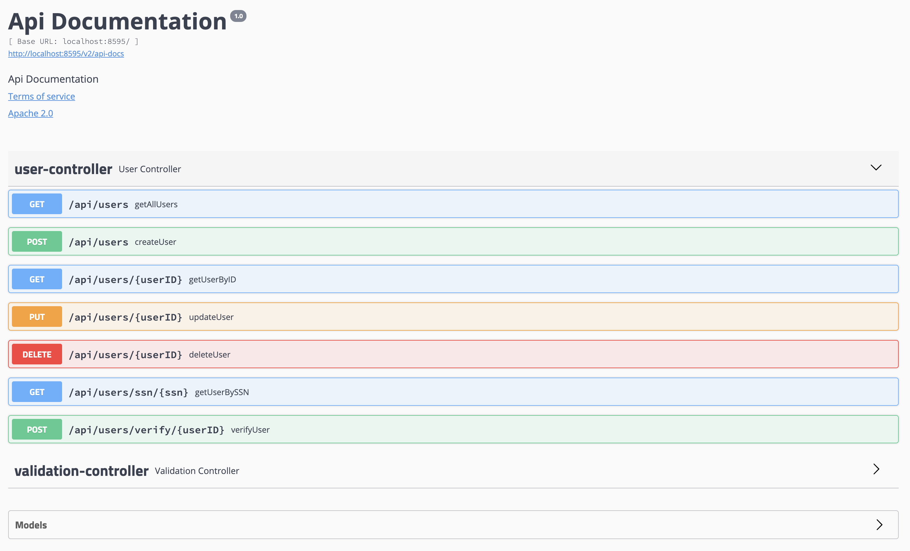

# Mock Backend Services for the service chaining demo

This repository contains the backend service developed for a demo which explains the service chaining capabilities. Please note that thr services chaining needs to be implemented using an integration platform and please refer to this blog to learn more about implementing the same with WSO2 API Manager.

## Starting the services
- The project can be build via maven by executing `mvn clean install`.
- Or else the jar file can be found in `target/` directory

## Available Service

Once the mock services are up running the following swagger UI can be accessed from [http://localhost:8595/swagger-ui.html#/]()

